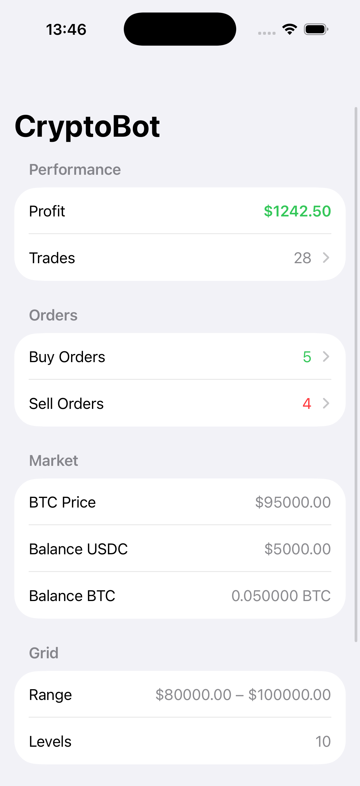
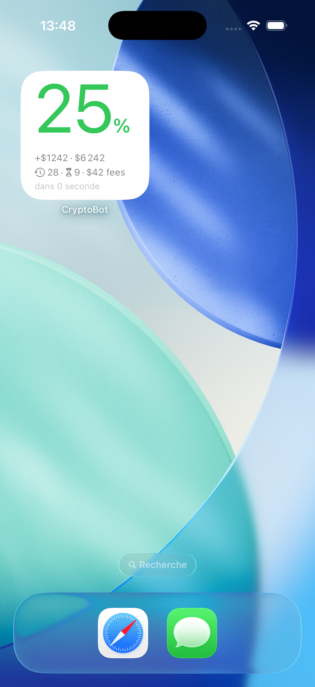

# Crypto Bot

Grid trading bot for BTC/USDC on Kraken.

<p align="center">
  
  
</p>

## ⚙️ How it works

The bot exploits natural Bitcoin price oscillations to generate profits automatically.

It places a **grid of orders** around the current price: buy orders below and sell orders above. Each time the price moves up then back down (or vice versa), a buy and a sell are triggered — the difference between the two is the profit.

The trading cycle runs every 30 seconds: the bot checks the price, adjusts the grid if needed, and executes orders.

### Concrete example

With a grid between 80,000 and 100,000 USDC, 10 levels, 50 USDC per order:

1. The bot places buy orders at 80k, 82k, 84k… and sell orders at 92k, 94k, 96k…
2. Price drops to 84k → a buy order is filled
3. Price climbs back to 86k → a sell order is filled
4. The bot pockets the difference (~2k USDC spread × the BTC quantity)

## 🧩 Features

### Post-only orders

When enabled (`NITRO_POST_ONLY=true`), all orders are placed as **post-only** (Kraken flag `post`). This guarantees that the bot always pays maker fees (typically 0.16%) instead of taker fees (0.26%). If an order would immediately match and cross the spread, Kraken rejects it — the bot simply skips it and retries on the next cycle.

### Grid recentering

When enabled (`NITRO_GRID_RECENTERING=true`), the bot automatically **recenters the grid** when the price drifts too far from the active trading zone. This triggers when:

- The price moves **outside the grid range** entirely, or
- Less than **30% of levels** are within a useful distance (2× spacing) of the current price.

On recenter, all open orders are cancelled and a new grid is created centered on the current price, keeping the same width and number of levels.

### ATR volatility spacing

When enabled (`NITRO_VOLATILITY_ENABLED=true`), the grid spacing **adapts dynamically** to market volatility using the Average True Range (ATR) indicator. In calm markets, levels are tightened to capture smaller moves. In volatile markets, levels are widened to avoid excessive order churn.

The spacing multiplier is clamped between `NITRO_SPACING_MIN_MULTIPLIER` (default 0.5×) and `NITRO_SPACING_MAX_MULTIPLIER` (default 2.0×) relative to the reference ATR measured at grid creation.

### Stop-loss

When `NITRO_STOP_LOSS_PERCENT` is set to a value greater than 0, the bot monitors the **portfolio drawdown** from its peak value (high watermark). If the total portfolio value (USDC + BTC at current price) drops by more than the configured percentage, all orders are cancelled and trading stops automatically.

### Take-profit

When `NITRO_TAKE_PROFIT_USDC` is set to a value greater than 0, the bot monitors the **cumulative realized profit** across all completed trades. Once the total profit reaches the target, all orders are cancelled and trading stops automatically.

## 📋 Prerequisites

- A [Kraken](https://www.kraken.com) account with API keys (permissions: query balances, create orders)
- [Docker](https://www.docker.com) installed on the machine that will host the bot

## 🚀 Installation

1. Create a `.env` file with your configuration:

```env
# Kraken API keys
NITRO_KRAKEN_API_KEY=your-api-key
NITRO_KRAKEN_PRIVATE_KEY=your-private-key

# Dashboard access protection (optional)
NITRO_API_TOKEN=a-secret-token

# Grid parameters
NITRO_GRID_LOWER_PRICE=80000
NITRO_GRID_UPPER_PRICE=100000
NITRO_GRID_LEVELS=10
NITRO_ORDER_SIZE_USDC=50

# Sandbox mode: test without placing real orders
NITRO_SANDBOX_MODE=true

# Feature flags (all disabled by default)
NITRO_POST_ONLY=false
NITRO_GRID_RECENTERING=false
NITRO_VOLATILITY_ENABLED=false
NITRO_STOP_LOSS_PERCENT=0
NITRO_TAKE_PROFIT_USDC=0
```

2. Start the bot:

```bash
docker compose up -d
```

The dashboard is available at `http://localhost:3100/stats`.

## 🔧 Configuration

| Parameter | Description | Default |
|---|---|---|
| `NITRO_GRID_LOWER_PRICE` | Lower bound of the grid (in USDC) | `80000` |
| `NITRO_GRID_UPPER_PRICE` | Upper bound of the grid (in USDC) | `100000` |
| `NITRO_GRID_LEVELS` | Number of levels in the grid | `10` |
| `NITRO_ORDER_SIZE_USDC` | Amount per order (in USDC) | `50` |
| `NITRO_SANDBOX_MODE` | `true` = orders are validated by Kraken but not executed | `true` |
| `NITRO_POST_ONLY` | `true` = use post-only orders to pay maker fees only (rejected if it would cross the spread) | `false` |
| `NITRO_GRID_RECENTERING` | `true` = automatically recenter the grid when the price drifts away from the active zone | `false` |
| `NITRO_VOLATILITY_ENABLED` | `true` = dynamically adjust grid spacing based on ATR volatility | `false` |
| `NITRO_ATR_PERIOD` | Number of candles used to compute the ATR (only when volatility is enabled) | `14` |
| `NITRO_SPACING_MIN_MULTIPLIER` | Minimum spacing multiplier relative to reference ATR | `0.5` |
| `NITRO_SPACING_MAX_MULTIPLIER` | Maximum spacing multiplier relative to reference ATR | `2.0` |
| `NITRO_STOP_LOSS_PERCENT` | Stop trading when portfolio drops this % from its peak (0 = disabled) | `0` |
| `NITRO_TAKE_PROFIT_USDC` | Stop trading when cumulative profit reaches this USDC amount (0 = disabled) | `0` |

## 🐢 Getting started gradually

It's recommended to start cautiously:

1. **Sandbox** — Keep `SANDBOX_MODE=true` to verify everything works without risk. Orders are validated by Kraken but never executed.
2. **Micro-live** — Go live with minimal parameters: 3 levels, 10 USDC per order (~30 USDC committed total).
3. **Production** — Once confident, scale up to 10 levels and 50 USDC per order.

## 🔄 Order lifecycle

**Order statuses:**

| Status | Meaning |
|---|---|
| `pending` | Order created locally, not yet submitted to Kraken |
| `open` | Order live on Kraken, waiting to be filled |
| `filled` | Executed on Kraken, awaiting the counter-order at the next grid level to complete a trade |
| `traded` | Part of a completed buy+sell trade pair (archived) |
| `cancelled` | Cancelled before being filled (e.g. during grid recenter) |

**What is a trade?**

1 trade = 1 buy order filled at level N + 1 sell order filled at level N+1. Profit = (sell price − buy price) × BTC quantity − fees.

**Concrete lifecycle example** (grid $66k–$84k, spacing $2k):

```
1. Grid places buy at $70k (level 2) on Kraken → status: open
2. Price drops to $70k → Kraken fills the buy → status: filled
3. Bot places sell at $72k (level 3) → status: open
4. Price rises to $72k → Kraken fills the sell → status: filled
5. Bot detects both filled → records trade (profit ≈ $2k × sizeBtc − fees)
6. Both orders → status: traded
```

## 📱 iOS app

A companion iOS app lets you monitor the bot's performance (P&L, trades, open orders, balances) directly from your iPhone, with a home screen widget.


